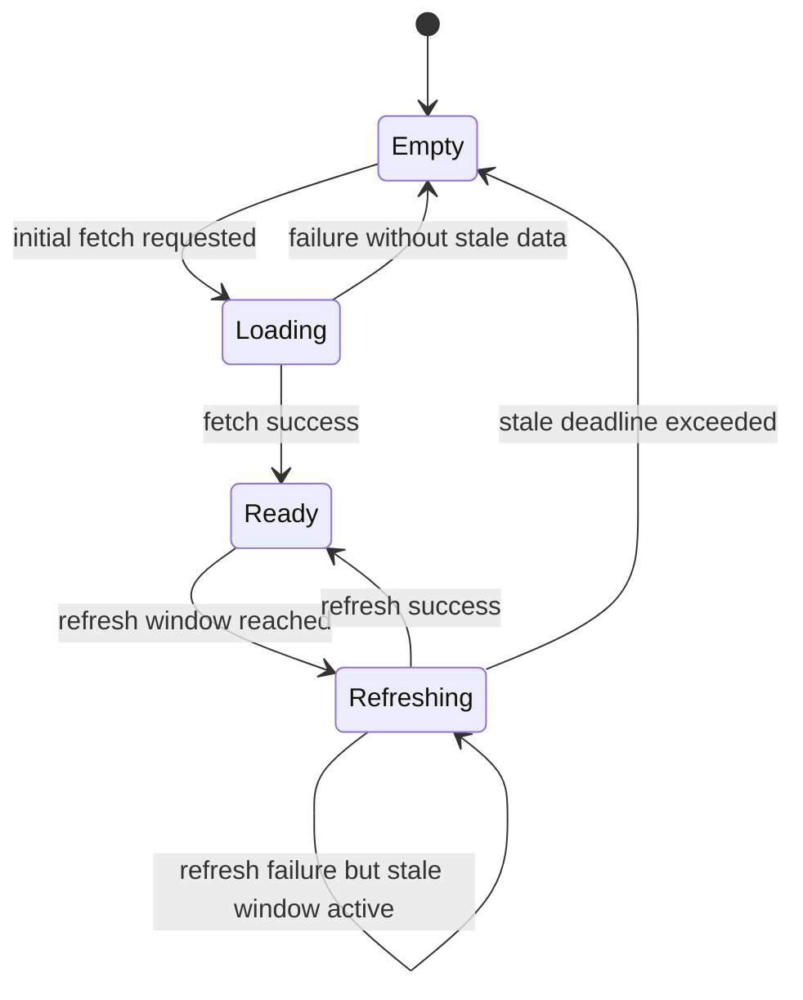

# Data Model: JWKS Cache

## Entities

### IdentityProviderRegistration

| Field | Type | Description | Validation |
|-------|------|-------------|------------|
| `tenant_id` | `String` | External identifier for the consuming tenant | Non-empty, ASCII letters, numbers, hyphen, max 64 chars |
| `provider_id` | `String` | Stable handle for the JWKS endpoint within a tenant | Non-empty, unique per tenant, matches `[a-zA-Z0-9_-]{1,64}` |
| `jwks_url` | `Url` | Canonical HTTPS JWKS endpoint | Must be HTTPS, host allowed by `allowed_domains`, path normalized |
| `refresh_early` | `Duration` | Time before TTL expiry to trigger refresh | ≥ 1s, default 30s, < TTL |
| `stale_while_error` | `Duration` | Window to serve stale data when refresh fails | ≥ 0s, default 60s |
| `min_ttl` | `Duration` | Lower bound for computed TTL | ≥ 30s |
| `max_ttl` | `Duration` | Upper bound for computed TTL | ≥ `min_ttl`, default 24h |
| `max_response_bytes` | `u64` | Response size guard | Default 1_048_576, must be > 0 |
| `negative_cache_ttl` | `Duration` | Cache duration for negative key lookups | ≥ 0s |
| `require_https` | `bool` | Enforce HTTPS-only policy | Defaults to true |
| `allowed_domains` | `Vec<String>` | Optional host allowlist | Each value lowercase, suffix match |
| `max_redirects` | `u8` | Redirect limit | Default 3, max 10 |
| `pinned_spki` | `Vec<SpkiFingerprint>` | Optional certificate pins | Fingerprints must be SHA-256 encoded |
| `prefetch_jitter` | `Duration` | Randomized delay for background prefetch | ≥ 0s, default 5s |
| `retry_policy` | `RetryPolicy` | HTTP retry configuration | See nested struct |

#### RetryPolicy

| Field | Type | Description | Validation |
|-------|------|-------------|------------|
| `max_retries` | `u32` | Maximum retry attempts | Default 2, ≥ 0 |
| `attempt_timeout` | `Duration` | Timeout per attempt | Default 3s, ≥ 100ms |
| `initial_backoff` | `Duration` | First retry delay | Default 250ms |
| `max_backoff` | `Duration` | Maximum retry delay | ≥ `initial_backoff` |
| `deadline` | `Duration` | Total retry budget | Default 8s, ≥ `attempt_timeout` |
| `jitter` | `JitterStrategy` | Optional jitter configuration | Enumerated type |

### JWKSCacheEntry

| Field | Type | Description | Validation |
|-------|------|-------------|------------|
| `tenant_id` | `String` | Reference to registration tenant | Foreign key to `IdentityProviderRegistration.tenant_id` |
| `provider_id` | `String` | Reference to registration provider | Foreign key to `IdentityProviderRegistration.provider_id` |
| `state` | `CacheState` | Current lifecycle state | See state machine |
| `jwks` | `Arc<JwkSet>` | Cached JWKS payload | Must contain validated keys |
| `etag` | `Option<String>` | ETag validator | If present, must be ASCII |
| `last_modified` | `Option<DateTime<Utc>>` | Last-Modified validator | Must be in RFC 7231 format |
| `expires_at` | `Instant` | Monotonic expiry timestamp | Derived from TTL after clamping |
| `next_refresh_at` | `Instant` | Scheduled refresh time | `<= expires_at`, includes jitter |
| `last_refresh_at` | `Instant` | Completion time of last refresh | Monotonic |
| `retry_backoff` | `Option<Duration>` | Next backoff duration | Reset to None after success |
| `error_count` | `u32` | Consecutive refresh failures | Reset after success |
| `stale_deadline` | `Option<Instant>` | Hard limit for stale usage | `>= expires_at` if present |

### TelemetryRecord

| Field | Type | Description | Validation |
|-------|------|-------------|------------|
| `timestamp` | `DateTime<Utc>` | Observation time | Monotonic source preferred |
| `tenant_id` | `String` | Tenant association | Foreign key |
| `provider_id` | `String` | Provider association | Foreign key |
| `metric` | `TelemetryMetric` | Metric type | Enumerated |
| `value` | `f64` | Measured value | ≥ 0 for counters, unconstrained for gauges |
| `labels` | `HashMap<String, String>` | Additional dimensions | Keys and values ASCII, sanitized |

### PersistentSnapshot

| Field | Type | Description | Validation |
|-------|------|-------------|------------|
| `tenant_id` | `String` | Tenant identifier | Matches registration |
| `provider_id` | `String` | Provider identifier | Matches registration |
| `jwks_json` | `String` | Serialized JWKS payload | UTF-8 JSON, size ≤ 1 MiB |
| `etag` | `Option<String>` | Stored validator | Optional |
| `last_modified` | `Option<DateTime<Utc>>` | Stored Last-Modified validator | Optional |
| `expires_at` | `DateTime<Utc>` | Absolute expiry (wall-clock) | Derived from snapshot time |
| `persisted_at` | `DateTime<Utc>` | Snapshot timestamp / last refresh | Captured at persistence |

## Relationships

- One `IdentityProviderRegistration` maps to zero or one active `JWKSCacheEntry`.
- Each `JWKSCacheEntry` references exactly one registration and may reference multiple telemetry records over time.
- `PersistentSnapshot` entries correspond one-to-one with registrations when persistence is enabled.
- Telemetry records can aggregate metrics across tenants; they remain append-only for audit trails.

## State Machine

### State Transition Rules

- `Empty → Loading`: Triggered by initial lookup or forced refresh when no valid JWKS exists. Acquire single-flight guard to avoid duplicate fetches.
- `Loading → Ready`: Upstream fetch succeeds; compute TTL via cache semantics, clamp to `[min_ttl, max_ttl]`, schedule `next_refresh_at` = `expires_at - refresh_early` with jitter.
- `Loading → Empty`: Fetch fails and no stale snapshot is permitted. Emit `jwks_fetch_total{status="error"}` and surface backoff metadata.
- `Ready → Refreshing`: `next_refresh_at` reached or manual refresh requested while existing JWKS remains valid. Readers continue using cached data.
- `Refreshing → Ready`: Refresh completes successfully; update validators, TTL, monotonic timers, and reset error counters.
- `Refreshing → Refreshing`: Refresh attempt fails but `stale_while_error` window has not elapsed. Increment `error_count`, compute increased backoff, and reschedule.
- `Refreshing → Empty`: Refresh retries exhausted or `stale_deadline` reached; cache invalidated and subsequent reads re-enter `Loading`.

## Key Validation Rules

- RSA keys must provide `n`, `e`, and optionally `kid`; reject duplicates with same modulus.
- EC keys must supply `crv`, `x`, `y`; ensure `crv` matches supported curves (`P-256`, `P-384`).
- OKP keys require `crv`, `x`; restrict to supported EdDSA curves (e.g., `Ed25519`).
- Keys lacking `kid` use deterministic fallback ordering: `(alg, use, kty, first occurrence order)` to maintain reproducibility.
- Reject keys with unknown `kty`, unsupported `alg`, or invalid base64url fields; log sanitized errors.

## Derived Views

- `TenantHealthSummary`: aggregated metrics per tenant (hit rate, refresh latency, error counts).
- `ProviderSnapshot`: combined view of registration, cache entry, and telemetry counters for observability dashboards.
